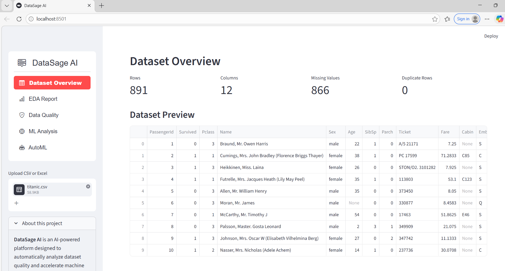
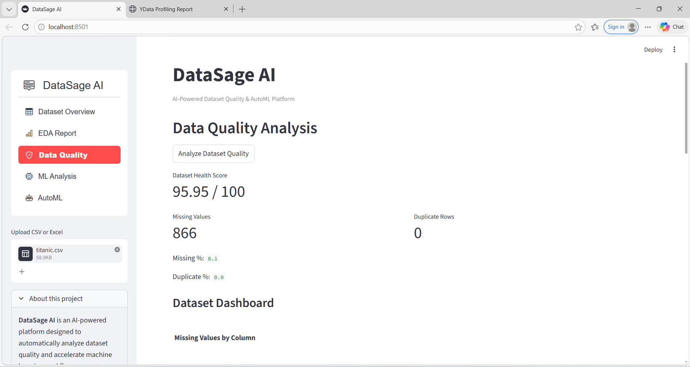
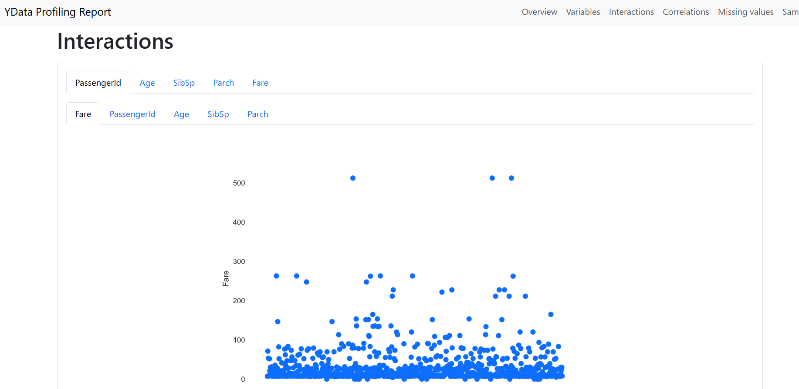
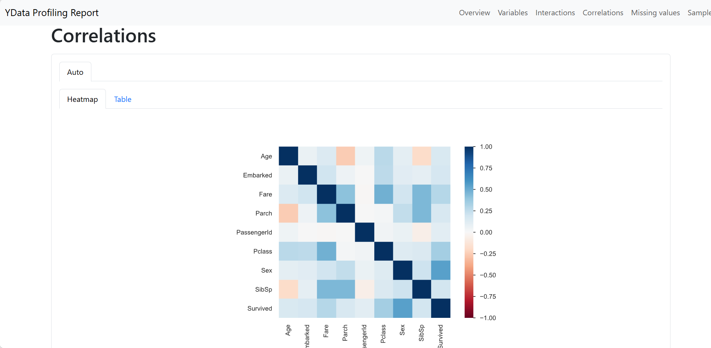
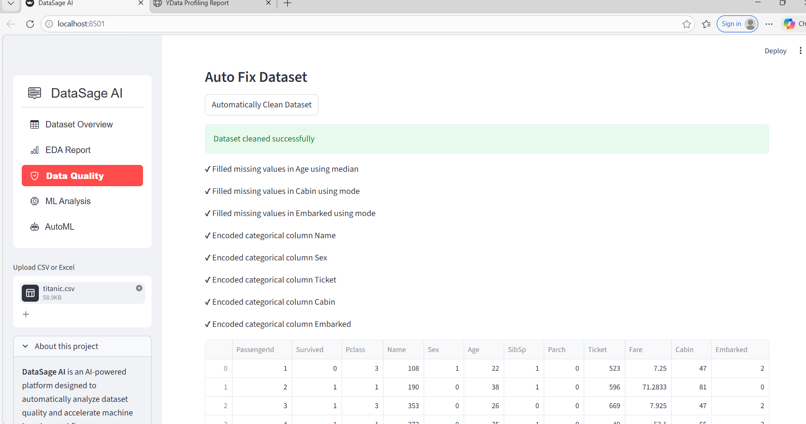
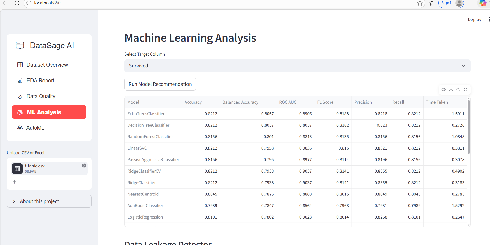
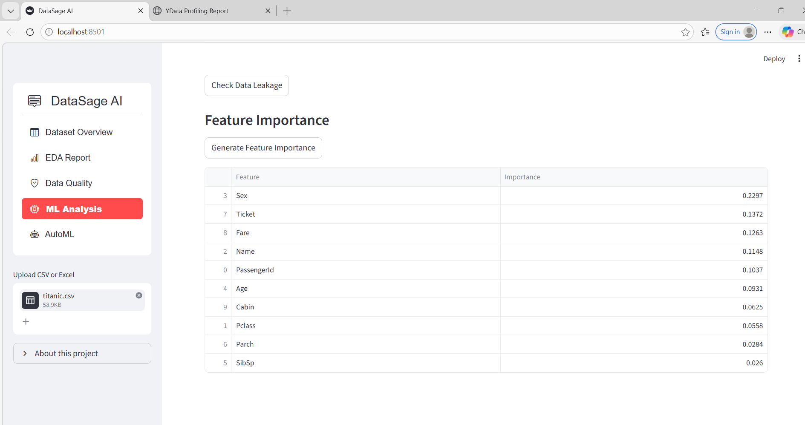
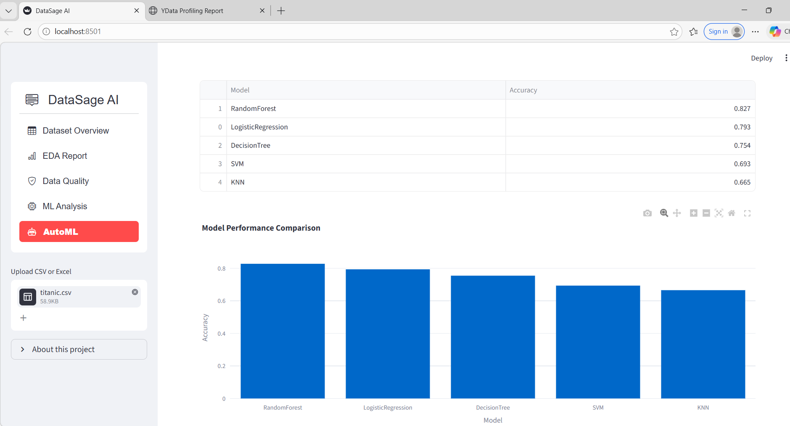

DataSage AI
AI-Powered Dataset Quality & AutoML Platform

DataSage AI is an AI-powered dataset analysis and AutoML platform built with Streamlit, Scikit-learn, and Pandas that automatically evaluates dataset quality, detects data issues, recommends cleaning strategies, and discovers the best-performing machine learning models.

The platform helps data scientists, analysts, and ML practitioners quickly understand dataset quality and build machine learning models faster.

SCREENSHOTS:
## Application Screenshots

### Dataset Overview

### Data Quality Analysis

### EDA Report

### Auto Data Cleaning

### ML Model Analysis

### Feature Importance

### AutoML Results

Problem Statement

Poor dataset quality is one of the biggest reasons machine learning models fail.

Data scientists spend a significant amount of time identifying issues such as:

• Missing values
• Duplicate records
• Outliers
• Skewed distributions
• Data leakage

Manual dataset exploration and cleaning can take hours.

DataSage AI automates the dataset analysis pipeline, enabling users to quickly diagnose dataset problems and build machine learning models efficiently.

Solution Overview

DataSage AI provides an end-to-end AI-assisted dataset analysis system that:

• Automatically analyzes dataset quality
• Detects common data issues
• Suggests intelligent cleaning strategies
• Generates automated dataset reports
• Recommends machine learning models
• Runs an AutoML pipeline to discover the best model
• Provides feature importance for explainability

All through an interactive Streamlit dashboard.

Key Features
Dataset Overview

• Upload CSV or Excel datasets
• Automatic dataset statistics
• Interactive dataset preview

Automated EDA Report

Generate a full Exploratory Data Analysis report using ydata-profiling.

Features include:

• Variable analysis
• Correlation detection
• Missing value visualization
• Dataset sample preview

The report can be downloaded as an interactive HTML file.

Dataset Health Scoring

Automatically evaluates dataset quality based on:

• Missing values
• Duplicate rows
• Dataset completeness

Produces a dataset health score out of 100.

Data Quality Issue Detection

Automatically detects dataset problems such as:

• Columns with high missing values
• Skewed feature distributions
• Potential outliers

AI Cleaning Suggestions

The system provides intelligent recommendations to clean the dataset:

• Remove duplicates
• Handle missing values
• Encode categorical variables

Automatic Dataset Cleaning

One-click dataset cleaning that:

• Fills missing values
• Encodes categorical variables
• Removes duplicate rows

Machine Learning Model Recommendation

Automatically trains multiple ML models and compares their performance.

Supported models:

• Logistic Regression
• Random Forest
• Decision Tree
• Support Vector Machine
• KNN

Displays a model accuracy comparison table.

AutoML Pipeline

Automatically finds the best performing machine learning model for the dataset.

Outputs include:

• Best model name
• Model accuracy
• Model comparison table

Feature Importance (Explainability)

Uses Random Forest feature importance to identify the most influential features in the dataset.

This helps understand:

• Which variables influence predictions the most.

Data Leakage Detection

Automatically checks for potential data leakage risks by analyzing high correlations between features and the target variable.

AI Dataset Report

Generates an automated human-readable dataset summary, highlighting:

• Dataset size
• Missing values
• Duplicate rows
• Key dataset characteristics

System Architecture
User Dataset Upload
        │
        ▼
Streamlit Dashboard
        │
        ▼
Data Processing Layer
(Pandas preprocessing)
        │
        ▼
Data Quality Engine
 ├ Missing value detection
 ├ Duplicate detection
 ├ Outlier analysis
 ├ Skew detection
 ├ Data leakage detection
        │
        ▼
AI Assistance Layer
 ├ Cleaning suggestions
 ├ Dataset report generator
        │
        ▼
ML Pipeline Engine
 ├ Model recommendation
 ├ AutoML pipeline
 ├ Feature importance
        │
        ▼
Visualization Dashboard
(Streamlit + Plotly)
Tech Stack
Programming Language

Python

Libraries

Streamlit
Pandas
Scikit-learn
NumPy
Plotly
ydata-profiling

Machine Learning Models

Logistic Regression
Random Forest
Decision Tree
Support Vector Machine
KNN

Project Structure
DataSage-AI
│
├── app.py
│
├── utils
│   ├── auto_fix.py
│   ├── automl_pipeline.py
│   ├── cleaning_suggestions.py
│   ├── data_quality.py
│   ├── dataset_report.py
│   ├── dashboard.py
│   ├── error_detection.py
│   ├── leakage_detector.py
│   ├── model_recommender.py
│   └── explainability.py
│
├── requirements.txt
└── README.md

Installation

Clone the repository
git clone https://github.com/Saumya-eng/datasage-ai.git

Move into the project directory
cd datasage-ai

Install dependencies
pip install -r requirements.txt

Run the application
streamlit run app.py

How It Works

Upload a dataset (CSV / Excel)

View dataset overview

Run automated data quality analysis

Detect dataset issues and cleaning suggestions

Generate automated EDA report

Run machine learning model recommendation

Execute AutoML to find the best model

View feature importance for explainability

Example Dataset for Testing

Titanic Dataset

https://www.kaggle.com/datasets/yasserh/titanic-dataset

Target column: Survived

Student Performance Dataset

Download
https://raw.githubusercontent.com/selva86/datasets/master/StudentsPerformance.csv

Target column example:

math score

Future Improvements

• Support for large datasets using Apache Spark
• Deep learning model integration
• Chatbot Integration
• Cloud storage integration (AWS / GCP)
• Real-time dataset monitoring
• Automated feature engineering

Credits

This project extends the following open-source Streamlit EDA project:

https://github.com/camilasbraz/streamlit-exploratory-analysis

Additional AI-powered data quality and machine learning features were implemented to enhance dataset analysis and model discovery.

License

MIT License

Author

Saumya Verma
B.Tech CSE (AI/ML)